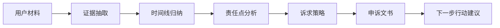

# MIMO ClaimPilot Agent

一个面向普通人的多模态维权证据链 Agent：把聊天截图、订单截图、物流记录、付款凭证、合同文本等材料，自动整理成“时间线 + 责任点 + 证据清单 + 诉求策略 + 投诉/协商文书”。

默认提供离线演示模式；配置 MIMO/OpenAI-compatible API Key 后可切换为真实模型推理。

## 项目创意

ClaimPilot 的想法是做一个“普通人的维权副驾驶”。它不替用户夸大诉求，也不生成情绪化投诉，而是把杂乱材料变成一份事实清楚、证据闭环、诉求克制的维权包。

用户可以把聊天记录、订单信息、物流记录、付款凭证、合同条款等材料粘贴或上传到系统中。Agent 会先抽取关键事实，再按时间线组织经过，接着分析承诺与履约之间的差异，最后生成可提交给平台客服、商家或调解方的申诉内容。

## Demo 形态

- Web Demo：浏览器打开首页即可输入案例材料并生成证据链。
- API：`POST /api/analyze` 输出结构化 JSON，便于接入移动端、小程序或客服后台。
- 离线模式：无 Key 时使用内置规则引擎，也可以体验完整流程。
- LLM 模式：配置 MIMO/OpenAI-compatible API 后调用真实模型推理。

## 为什么做这个

很多消费者遇到快递延误、商家虚假承诺、售后扯皮、课程/租房/二手交易纠纷时，并不是没有证据，而是证据分散在截图、订单、聊天记录和付款凭证里。普通人很难把它们组织成平台客服能快速理解的“证据链”。ClaimPilot 的目标是让用户用手机上传材料后，自动生成一份结构清晰、措辞克制、诉求明确的维权包。

## 核心能力

- 多文件证据接收：支持图片、文本、PDF 文件占位上传。
- 证据抽取 Agent：提取承诺、时间、金额、物流节点、付款信息、争议点。
- 时间线 Agent：将分散材料按时间顺序组织。
- 责任分析 Agent：找出“承诺与履约不一致”“费用损失”“沟通记录”等关键点。
- 策略 Agent：给出合理诉求、备选诉求和平台沟通策略。
- 文书生成 Agent：生成 150 字短申诉、完整投诉信、客服沟通话术。
- 离线演示模式：没有 API Key 也能跑通流程。
- MIMO/OpenAI-compatible 模式：配置 API 后调用真实大模型。

## Agent 工作流



## 适用场景

- 快递服务与承诺不一致。
- 商家承诺退款、补发、加急后未履行。
- 课程、租房、二手交易等合同或口头承诺争议。
- 用户需要把零散截图整理成平台客服能快速理解的材料。

## 快速开始

```bash
cd mimo_claimpilot_agent
python -m venv .venv
# Windows: .venv\Scripts\activate
source .venv/bin/activate
pip install -r requirements.txt
uvicorn app.main:app --reload --port 8000
```

浏览器打开：

```text
http://127.0.0.1:8000
```

## 配置 MIMO / OpenAI-compatible API

复制环境变量模板：

```bash
cp .env.example .env
```

编辑 `.env`：

```env
MIMO_API_KEY=你的_key
MIMO_BASE_URL=https://api.example.com/v1
MIMO_MODEL=mimo-agent-model
USE_LLM=true
```

如果 `USE_LLM=false` 或没有配置 Key，项目会使用内置规则引擎进行离线演示。

## 示例输入

可直接复制 `examples/sample_case.txt` 中的内容到网页输入框。

## API

### POST `/api/analyze`

请求：

```json
{
  "case_title": "顺丰特快未按约发货",
  "goal": "希望平台介入并退还差价、补偿延误损失",
  "materials": [
    {"name": "聊天记录", "content": "我反复要求商家发顺丰特快，商家回复可以..."}
  ]
}
```

返回：

```json
{
  "summary": "...",
  "timeline": [...],
  "risk_points": [...],
  "claim_strategy": "...",
  "short_appeal_150": "...",
  "full_letter": "..."
}
```

## 项目结构

```text
app/
  main.py              # FastAPI 入口
  schemas.py           # 数据结构
  agents.py            # 多 Agent 工作流
  llm_client.py        # MIMO/OpenAI-compatible 接入
  offline_engine.py    # 无 Key 离线推理
web/
  index.html           # 前端页面
examples/
  sample_case.txt
  sample_request.json
tests/
  test_offline_engine.py
.github/workflows/
  ci.yml
```

## License

MIT
